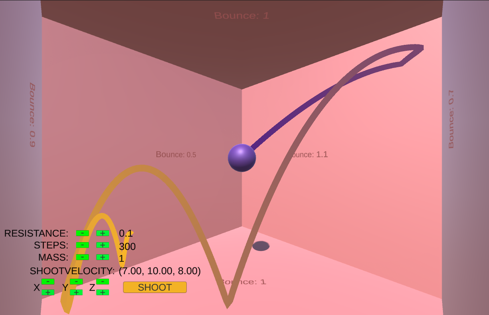

# Physics Simulation
In a physics simulation you aim to reproduce real-world events using computational power. This is done using mathematical equations (more in depth about those later). Loads of external factors have to be accounted for when trying to recreate such phenomena. It is up to the creator of such a simulation how many factors you include for more accuracy.

The accuracy depends on the purpose of the simulation. If it were for scientific research accuracy is of the utmost importance. If it were to simulate physics in a videogame, you would prioritize real world performance and keep it simple.

# 3D Unity Scene: Ball Simulation
For my own implementation of this topic, I chose to recreate a scene in which a sphere continuously updates its position according to the laws of physics and in which 6 walls create a simple room to use as a collision system. The ball does not only update its position, but you are also able to see its predicted trajectory. I am not using built-in logic from Unity itself for physics nor for collisions, everything is homemade. Unity is used for its 3D environment, rendering of the sphere and walls and visualization of the predicted trajectory.
## Events
There are 2 main events.

    1. Updating the sphere
        - Formula: p = v * t
            + p = position
            + v = velocity
            + t = time (in my case Unity's Time.deltaTime is always used, since it is a realtime calculation)
    2. Collision
        - It happens after you have updated the sphere to its new velocity.
        - Collision check
            - Formula: d <= r
                + d = distance between plane and sphere center
                + r = radius sphere
                + if true they are colliding
        - Restore to position right before hitting the plane
            - Formula: p = n * (r - d)
                + p = collision point
                + n = normal of colliding plane
                + r = radius sphere
                + d = distance between plane and sphere center
        - Reflect
            - Formula: v1 = v0 - 2 * v * n * n
                + v0 = incoming velocity
                + v1 = outgoing velocity
                + n = normal of the colliding surface
            - Apply elasticity (explained in parameters)
## Parameters Of Choice
I decided that since it is a realtime application I would take the following factors into account:

    1. Mass, weight of the sphere, determines the:
        - intensity of gravity.
        - intensity of drag.
        - intensity of acceleration.
        - intensity of collision.
    2. Gravity
        - It is a constant (in my case -9.81).
        - Combined with the mass it determines the vertical acceleration.
        - Formula: F = m * g
            + F = gravity force
            + m = mass
            + g = gravity constant (9.81)
    3. Drag
        - It is the force acting opposite to velocity with respect to air resistance.
        - Formula: F = 0.5 * Cd * r * A * V^2 / m
            + F = drag force
            + Cd = drag coefficient
            + r = air density
            + A = surface area 
            + V = velocity
            + m = mass
        - The greater the velocity the greater the drag force.
        - The greater the mass the smaller the drag force.
        - The greater the Cd value the greater the drag force.
        - All other parameters can be modified but are kept constant for simplicty.
        - The surface of a sphere will always have the same surface area in any direction.
    4. Acceleration
        - It will update the velocity every frame. In this case it will decelerate the sphere until is stationary.
        - It is a vector that combines the drag and gravity forces.
        - Formula: a = m * (d + g)
            + a = acceleration
            + m = mass
            + d = drag
            + g = gravity (note: this is only for the y-component of the vector)
    5. Velocity
        - It will update the position of the sphere every frame. 
        - Formula: v1 = v0 + a * t
            + v1 = velocity after accelaration
            + v0 = velocity before accelaration
            + a = acceleration
            + t = time (in my case Unity's Time.deltaTime is always used, since it is a realtime calculation)
    6. Elasticity
        - Every plane/surface has an elasticity factor between 0 and 1.
        - Upon collision the outgoing velocity is multiplied by this factor. 
        - 0 meaning a perfectly inelastic collision (all momentum gone).
        - 1 meaning a perfectly elastic collision (all momentum is maintained).
        - All 6 planes have different elasticity/bounce values to test different circumstances (1 plane has a value 1.1 to test a collision that speeds up the ball).
        - Formula: v1 = v0 * e / m
            + v1 = veloctiy after elasticity
            + v0 = velocity before elasticity
            + e = elasiticy
            + m = mass
        - The greater the mass the less elastic the collision will be.
## Trajectory Prediction
To predict the trajectory I use a hypothetical ball and velocity. You can choose how many steps of the trajectory are predicted (collision included). I then store all the points and add them to Unity's line renderer component.
# Result
The result is a simple simulation where you can change the following parametrers: mass, initial velocity, steps, Cd (drag coefficient). After changing those you immediatly get a preview of an updated trajectory. It is also possible to dive in the code to modify some constants such as the bounce factor of a plane, the surface and radius of the ball, etc. Here is a .GIF file of the main functionality of my project. 

## Progress
It was useful that I could complete this project in Unity. I was able to start with some built-in components and use my own implementations later on.

    At first I was using the built-in OnTriggerEnter() function 
    for my planes to calculate when a collision would occur.
    I later created my own cartesian planes in my physics script.
    This would prove useful in the future for collisions when predicting the trajectory.
# Conclusion
This project is but a first step in the exploration of what physics simulations are capable of. It is a neat and simplified version of physics that anyone can use. The next steps are to integrate more parameters such as angular velocity for the ball, wind etc. I could also implement more complex collisions. 

# References
1. De Pauw, I., & Masselis, B. (2021). Animation Maths. Lannoo Campus. https://www.ecampuslearn.com
    - Chapter 9.3 Translational motion
    - Chapter 9.6 Independence of motion
    - Chapter 10.1 Collision detection using circles and spheres
2. Falling object with air resistance. (s.d.). https://www.grc.nasa.gov/www/k-12/VirtualAero/BottleRocket/airplane/falling.html 
3. Vedantu. (s.d.). Density of Air. VEDANTU. https://www.vedantu.com/physics/density-of-air
4. McREYNOLDS, T., & Blythe, D. (2005). Texture mapping. In Elsevier eBooks (pp. 73–102). https://doi.org/10.1016/b978-155860659-3.50007-x
5. Ten Minute Physics. (2021, 28 augustus). 01 - Writing a physics simulation in 10 minutes [Video]. YouTube. https://www.youtube.com/watch?v=oPuSvdBGrpE
6. ForlornU. (2023, 28 mei). Projectile Trajectory Predictor - Unity Physics & Coding Tutorial [Video]. YouTube. https://www.youtube.com/watch?v=rgJGkYM2_6E
7. contour3D. (2020, 4 november). Draw lines in 3D using LineRenderer [Video]. YouTube. https://www.youtube.com/watch?v=mgmfZRllpzs
